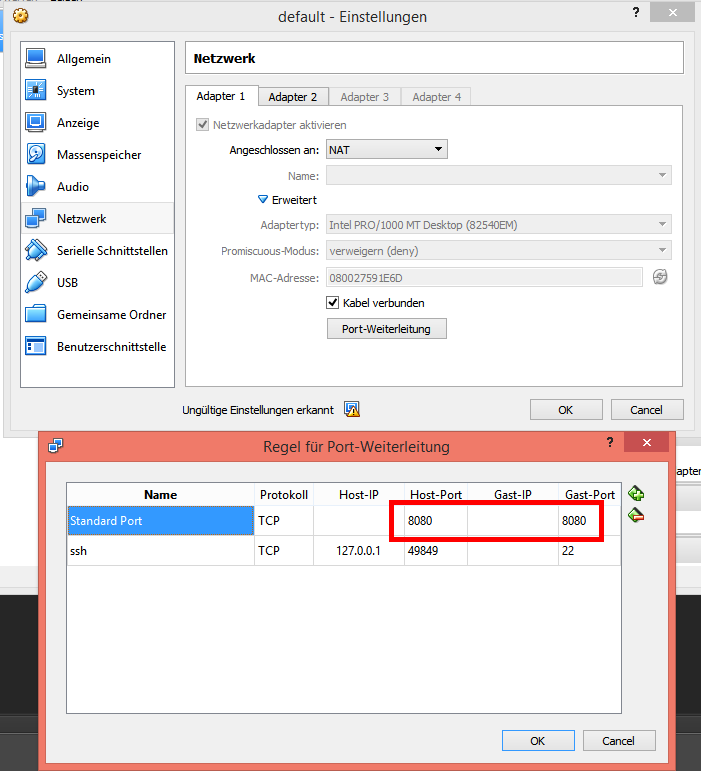

# Identification Server

An automated build of the identification server is available on DockerHub: https://hub.docker.com/r/matbloch/uids/

### Installation (Windows, Docker)

1. Download and install Docker Toolbox (Win/OSX need Boot2Docker VM to run docker): [**Download Link**](https://www.docker.com/products/docker-toolbox)
2. **Enable Portmapping from Host system to Boot2Docker VM:**
	- Open VirtualBox Manager, Go to Boot2Docker VM Settings > Networking
	- For Adapter 1 (NAT) set port forwarding under advanced settings
	- Protocoll: TCP, Host IP: -, Client IP: -, Port: 8080 (Server Port)
	
3. Start Boot2Docker: Head to Docker Toolbox installation directory and run `start.sh` with Git shell
4. Pull server image:
```bash
$ docker pull matbloch/uids
```
5. Start server with forwarded port 8080:
```bash
$ winpty docker run -p 8080:8080 -ti matbloch/uids //bin/bash
```


## Demos/Tests

### Share Local Installation with dockermachine
Allows you to quickly make adjustments to the server code on any host.

1. Share Local Ressource to VM
	- Open VirtualBox Manager, Go to Boot2Docker VM Settings > Shared Folders
	- Add target folder under the name "/User". "/User" and some other (predefineds) folders automatically mapped to the docker VM
2. Start docker image and share "/Users" under a custom name using the parameter `-v`: 
	- `winpty docker run -v //Users:/mycustomdir -ti matbloch/uids //bin/bash`


### `test/tcp_connection` Test TCP Connection: Host > boot2docker > Container

1. Start docker container and expose port 8080
```bash
winpty docker run -p 8080:8080 -ti matbloch/uids //bin/bash
```
2. Start server on container (running on port 8080)
```bash
python ../test/tcp_connection/server.py
```
3. Start Python client on host machine
```bash
python ../test/tcp_connection/client.py
```

## Q/A and Problem Solving

### Known Problems

#### 1. Invalid Env. Variables

> docker: An error occurred trying to connect: Post http://%2F%2F.%2Fpipe%2Fdocker
_engine/v1.24/containers/create: open //./pipe/docker_engine: Das System kann di
e angegebene Datei nicht finden..

Solution:

```bash
$ docker-machine env
```
Where `C:\lib\Docker Toolbox\docker-machine.exe` is the path to your docker machine:
```bash
$ eval $("C:\lib\Docker Toolbox\docker-machine.exe" env)
```
### FAQ

#### My server is slow, how do I boost performance?
- Assign more memory to the VM
- Assign **multiple** cores to the VM (huge performance increase)


